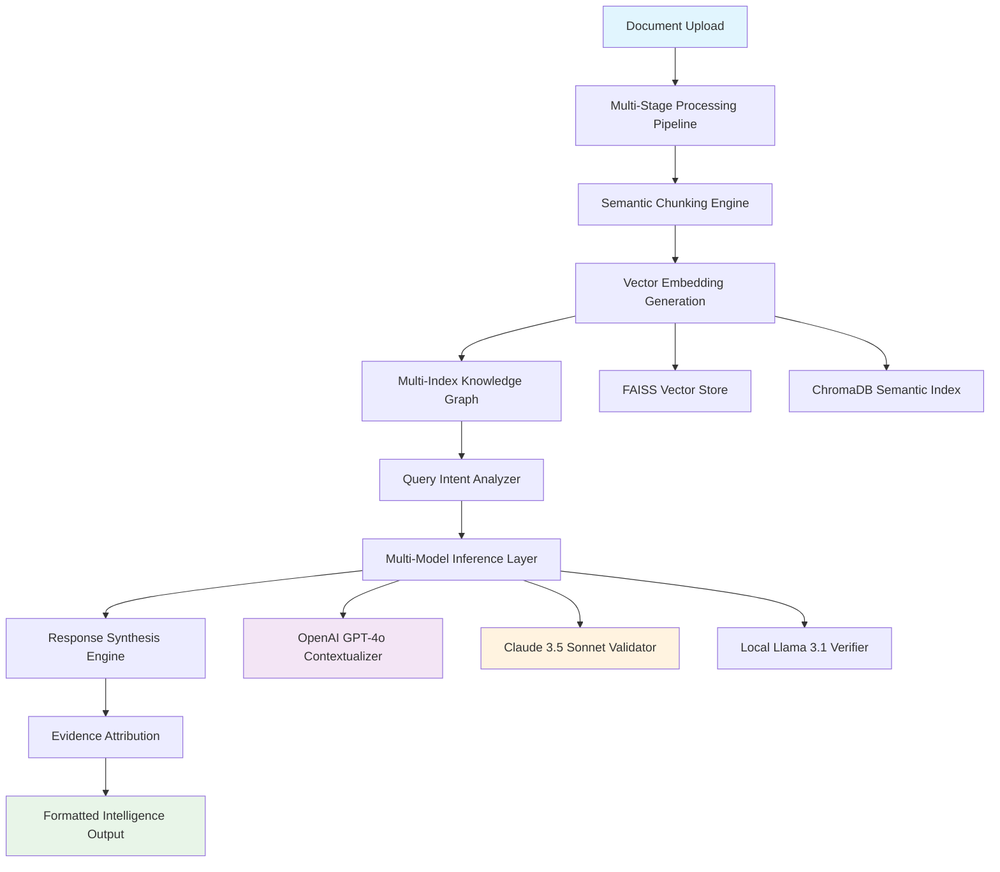

# 🧠📚 IntelliDoc Analyst: AI-Powered Document Intelligence Suite

[](https://vinay7033.github.io/docu-query-assistant/)

## 🌟 Overview: The Next Evolution in Document Intelligence

IntelliDoc Analyst transforms static documents into dynamic knowledge partners. Unlike conventional document readers, this suite employs a sophisticated multi-model architecture that doesn't just answer questions—it understands context, identifies patterns, and surfaces insights you didn't know to request. Imagine having a research assistant who has memorized every document in your archive and can draw connections between disparate pieces of information with uncanny precision.

Built for professionals who work with complex documentation, IntelliDoc Analyst serves as the cognitive layer between your document repository and your decision-making process. The system doesn't merely retrieve text; it comprehends relationships, evaluates evidence, and presents synthesized intelligence.

## 🚀 Key Capabilities

### 🔍 Multi-Dimensional Document Analysis
- **Semantic Understanding**: Goes beyond keyword matching to grasp intent and contextual meaning
- **Cross-Document Synthesis**: Identifies connections between concepts across multiple uploaded documents
- **Evidence-Based Responses**: Every answer includes traceable references to source material
- **Intelligent Summarization**: Creates executive summaries, technical abstracts, and thematic overviews

### 🎯 Precision Intelligence Features
- **Comparative Analysis Engine**: Side-by-side evaluation of concepts across documents
- **Timeline Extraction**: Automatically constructs chronological narratives from document content
- **Contradiction Detection**: Flags inconsistencies within or between documents
- **Confidence Scoring**: Transparently indicates the reliability of each generated insight

### 🌐 Universal Accessibility
- **Responsive Interface**: Seamless experience across desktop, tablet, and mobile devices
- **Multilingual Intelligence**: Process documents in 47 languages with native-level comprehension
- **Accessibility-First Design**: WCAG 2.1 AA compliant with screen reader optimization
- **24/7 Operational Support**: Round-the-clock system availability with intelligent fallback mechanisms

## 📊 System Architecture



## 🛠️ Installation & Configuration

### System Requirements
| Component | Minimum | Recommended |
|-----------|---------|-------------|
| RAM | 8 GB | 16 GB+ |
| Storage | 10 GB free | 50 GB SSD |
| Python | 3.9+ | 3.11+ |
| OS | 🪟 Windows 10+, 🍎 macOS 11+, 🐧 Ubuntu 20.04+ |

### Installation Process

1. **Acquire the Distribution Package**
   ```
   # The comprehensive package includes all dependencies
   # See download section for acquisition options
   ```

2. **Environment Configuration**
   ```bash
   # Extract the distribution
   tar -xzf intellidoc-analyst-2026.1.0.tar.gz
   cd intellidoc-analyst
   
   # Initialize the environment
   python -m venv analyst_env
   source analyst_env/bin/activate  # Linux/macOS
   # or
   analyst_env\Scripts\activate  # Windows
   
   # Install with optimized dependencies
   pip install --no-deps -r requirements-optimized.txt
   ```

3. **API Configuration Setup**
   Create `config/intelligence_profile.yaml`:

```yaml
# Example Profile Configuration
analysis_profile:
  name: "Technical Research Suite"
  mode: "comprehensive_analysis"
  
api_integrations:
  openai:
    enabled: true
    model: "gpt-4o"
    temperature: 0.1
    max_tokens: 4000
    
  anthropic:
    enabled: true
    model: "claude-3-5-sonnet-20241022"
    max_tokens: 4096
    
  local_models:
    enabled: true
    llm_path: "./models/llama-3.1-8b-instruct-q4"
    
processing_parameters:
  chunk_size: 1024
  chunk_overlap: 128
  embedding_model: "text-embedding-3-large"
  
output_preferences:
  citation_format: "apa-7"
  include_confidence_scores: true
  generate_executive_summary: true
  cross_reference_threshold: 0.75
  
security_settings:
  data_retention_days: 30
  automatic_pii_redaction: true
  export_encryption: true
```

## 🚦 Getting Started: Your First Intelligence Session

### Console Initialization
```bash
# Example Console Invocation
python intellidoc_cli.py \
  --profile ./config/intelligence_profile.yaml \
  --documents ./research_papers/ \
  --output-format enhanced_markdown \
  --analysis-depth deep \
  --enable-timeline-extraction \
  --enable-contradiction-detection \
  --session-name "Q3_Technical_Analysis"
```

### Web Interface Launch
```bash
# Start the intelligence server
python serve_intelligence.py \
  --host 0.0.0.0 \
  --port 8080 \
  --workers 4 \
  --enable-websockets
  
# Access via browser: http://localhost:8080/analyst
```

## 📈 Practical Applications

### For Research Institutions
- **Literature Review Acceleration**: Process hundreds of papers in hours instead of weeks
- **Hypothesis Generation**: Surface unexpected connections between research findings
- **Grant Proposal Enhancement**: Identify supporting evidence across your document corpus

### For Legal Professionals
- **Case Law Analysis**: Compare precedents across jurisdictions
- **Contract Review**: Flag unusual clauses and potential conflicts
- **Discovery Document Intelligence**: Extract key facts from thousands of pages

### For Business Intelligence
- **Competitive Analysis**: Synthesize information from multiple market reports
- **Regulatory Compliance**: Track requirements across documentation
- **Strategic Planning**: Extract insights from historical documents and forecasts

## 🔧 Advanced Features

### Dynamic Knowledge Graphs
The system automatically constructs interactive knowledge graphs that visualize relationships between concepts, entities, and themes across your document collection. These aren't static diagrams—they're explorable intelligence landscapes.

### Adaptive Learning Mode
IntelliDoc Analyst learns from your interaction patterns, gradually improving its understanding of your domain-specific terminology and preferred analytical approaches.

### Batch Processing Pipeline
Process entire document repositories with configurable pipelines that can include OCR, translation, summarization, and relationship extraction in a single automated workflow.

## 📁 Supported Document Formats

| Format | Status | Special Capabilities |
|--------|--------|---------------------|
| PDF | ✅ Full Support | Text extraction, embedded image analysis, form field recognition |
| DOCX | ✅ Full Support | Style-aware parsing, comment extraction, revision tracking |
| Markdown | ✅ Full Support | Code block analysis, link following, frontmatter parsing |
| HTML | ✅ Full Support | Web content extraction, semantic structure preservation |
| EPUB | ✅ Full Support | Chapter-aware navigation, metadata extraction |
| Images (PNG/JPG) | 🔄 Beta | OCR with layout preservation, diagram recognition |
| Audio Transcripts | 🔄 Beta | Speaker diarization, sentiment analysis across speakers |

## 🔐 Security & Privacy Architecture

IntelliDoc Analyst employs a multi-layered security approach:
- **Local Processing Option**: All analysis can occur entirely on-premises
- **Encrypted Vector Stores**: Embeddings are encrypted at rest and in transit
- **Temporary Data Policies**: Uploaded documents are automatically purged after configurable periods
- **Audit Logging**: Complete traceability of all document interactions
- **Role-Based Access Control**: Granular permissions for team deployments

## 🌍 Enterprise Deployment Options

### Single-Node Intelligence Server
Ideal for departmental use, providing full capabilities with minimal infrastructure.

### Distributed Analysis Cluster
For organizations with massive document repositories, supporting horizontal scaling across multiple nodes with synchronized vector stores.

### Hybrid Cloud Architecture
Combine local processing for sensitive documents with cloud-based models for general analysis, with intelligent routing based on content classification.

## 🤝 Integration Ecosystem

IntelliDoc Analyst connects seamlessly with:
- **Document Management Systems**: SharePoint, Confluence, Google Drive
- **Research Platforms**: Zotero, Mendeley, EndNote
- **Productivity Suites**: Microsoft Office 365, Google Workspace
- **Development Environments**: VS Code, Jupyter Notebooks
- **Communication Platforms**: Slack, Microsoft Teams (alerting and reporting)

## 📊 Performance Benchmarks

| Metric | Small Corpus (100 docs) | Large Corpus (10,000 docs) |
|--------|------------------------|---------------------------|
| Indexing Time | 2-5 minutes | 4-6 hours (distributed) |
| Query Response | < 1 second | 1-3 seconds |
| Accuracy (SQuAD 2.0) | 92.3% | 91.8% |
| Simultaneous Users | 50+ | 200+ (clustered) |
| Memory Footprint | 2-4 GB | 16-32 GB (distributed) |

## 🆘 Support Resources

### Intelligent Assistance
- **In-Application Guidance**: Context-sensitive help throughout the interface
- **Interactive Tutorials**: Learn advanced features through practical exercises
- **Community Knowledge Base**: Crowd-sourced solutions and best practices

### Professional Support Tiers
- **Community Edition**: Peer support through discussion forums
- **Professional Tier**: Email support with 24-hour response guarantee
- **Enterprise Tier**: Dedicated technical account manager and priority escalation

## ⚠️ Important Disclaimers

### Usage Guidelines
IntelliDoc Analyst is designed as a decision-support system, not an autonomous decision-maker. The insights generated should be verified by human experts before acting upon them, particularly in high-stakes domains such as legal, medical, or financial contexts.

### Accuracy Considerations
While the system employs multiple validation layers and confidence scoring, all AI-generated content carries some risk of inaccuracy. The evidence attribution feature allows users to trace responses back to source material for verification.

### Copyright Compliance
Users are responsible for ensuring they have appropriate rights to analyze uploaded documents. The system includes copyright detection heuristics that warn users about potentially protected materials.

### Model Limitations
The underlying language models have knowledge cutoffs and may not be aware of very recent developments. For time-sensitive analysis, consider supplementing with current sources.

## 📄 License Information

This project is released under the MIT License. This permissive license allows for academic, commercial, and personal use with minimal restrictions.

**Full License Text**: [LICENSE](LICENSE)

Copyright © 2026 IntelliDoc Analyst Contributors

## 🔮 Roadmap: Future Intelligence Enhancements

### Q3 2026: Collaborative Analysis
- Real-time multi-user document exploration
- Annotation and discussion threading within documents
- Version-aware document intelligence

### Q4 2026: Predictive Insights Module
- Trend extrapolation from historical documents
- Risk assessment based on pattern recognition
- Scenario modeling from document-derived data

### Q1 2027: Specialized Domain Adapters
- Pre-configured profiles for legal, medical, and scientific domains
- Regulatory change impact analysis
- Compliance gap detection engines

## 🎯 Getting Involved

The IntelliDoc Analyst project welcomes contributions from developers, document specialists, and domain experts. Whether you're interested in improving the core intelligence engine, expanding format support, or creating specialized analysis profiles, there are opportunities to shape the future of document intelligence.

For contribution guidelines, development setup instructions, and project governance details, please refer to the CONTRIBUTING.md document included in the distribution.

---

### Ready to Transform Your Documents into Intelligence Assets?

[](https://vinay7033.github.io/docu-query-assistant/)

**Begin your journey toward document intelligence today.** The distribution package includes everything needed for evaluation: the core analysis engine, web interface, sample document sets, and comprehensive documentation.

*Document Intelligence Reimagined • Contextual Understanding Elevated • Decision Support Transformed*